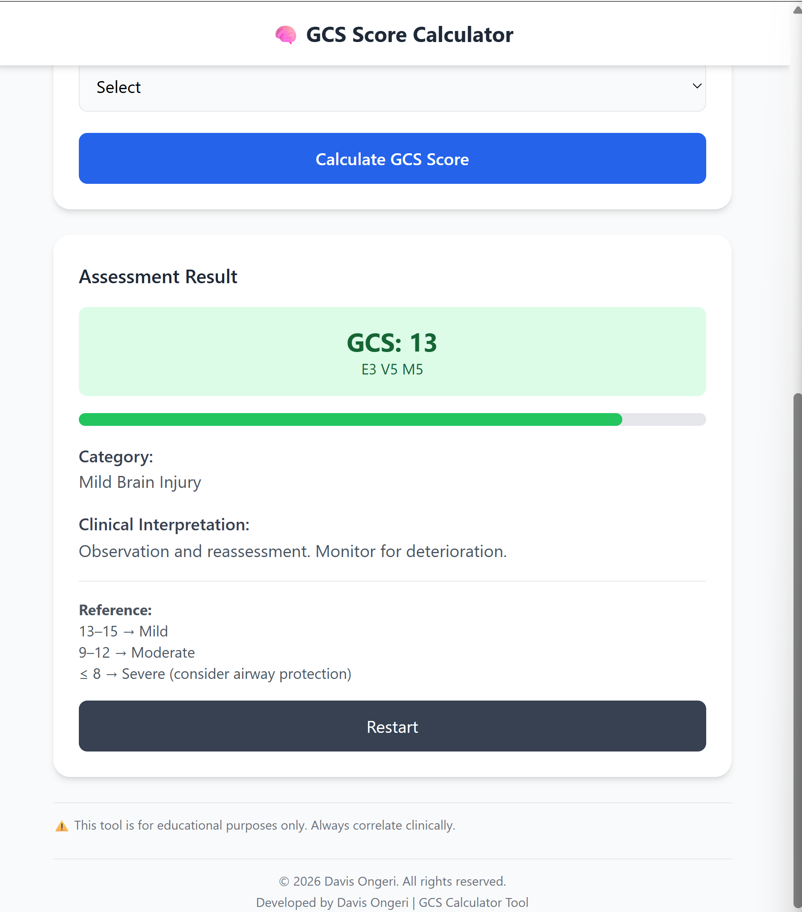
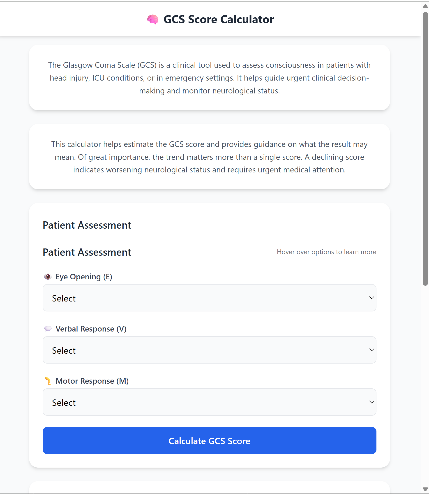

# 🧠 Glasgow Coma Scale (GCS) Calculator

A Flask-based web application that calculates and interprets the Glasgow Coma Scale (GCS), a clinical tool used to assess a patient's level of consciousness.

---

## 🚀 Features

- Calculate GCS based on:
  - Eye Opening (E)
  - Verbal Response (V)
  - Motor Response (M)
- Automatic interpretation:
  - Mild
  - Moderate
  - Severe
- Visual score breakdown
- Progress bar visualization
- Clinical guidance for decision-making
- Dark mode support 🌙

---

## 📸 Preview





---

## 🛠️ Technologies Used

- Python (Flask)
- HTML / Tailwind CSS
- Jinja2 templating

---

## 📁 Project Setup

### Navigate to the project:
```bash
cd gcs-calculator
````

### Create virtual environment:

```bash
python -m venv venv
```

### Activate it:

```bash
venv\Scripts\activate
```

### Install dependencies:

```bash
pip install -r requirements.txt
```

### Run the app:

```bash
python app.py
```

---

## 📊 GCS Interpretation

* 13–15 → Mild
* 9–12 → Moderate
* ≤ 8 → Severe (consider airway protection)

---

## ⚠️ Disclaimer

This tool is for **educational purposes only** and should not replace clinical judgment.

---

## 👨‍💻 Author

Developed by **Davis Ongeri**

---

## 📄 License

This project is open-source.

---

## 🚫 .gitignore

Create a `.gitignore` file in your project root to exclude unnecessary files:

```gitignore
venv/
__pycache__/
*.pyc
.env
```

---

## 📦 Repository Structure

```
gcs-calculator/
│
├── app.py
├── templates/
│   └── index.html
├── static/
│   └── images/
│       ├── gcs-home.png
│       └── gcs-result.png
├── requirements.txt
├── README.md
├── .gitignore
└── venv/ ❌ (not uploaded)
```

---

## 💡 Notes

* Always commit `requirements.txt`, not your `venv`
* Keep your project structured and clean
* Add screenshots to improve visual appeal

---

## ⭐ Future Improvements

* Add API endpoint for GCS scoring
* Add mobile responsiveness improvements
* Add chart visualization of GCS trends
* Deploy live version

---

